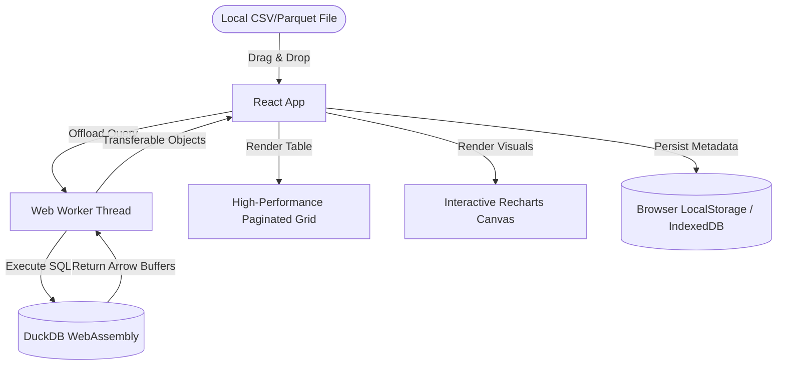

# ZeroCloud BI: Serverless Client-Side SQL Analytics

DuckBoard is a fully offline-first, high-performance Business Intelligence (BI) and SQL analytics workspace that runs 100% in your browser. Powered by **DuckDB-Wasm**, it allows you to ingest large datasets (CSV, TSV, Parquet) and perform complex relational queries (aggregations, joins, filters) with instant visual reporting—all without transferring a single byte of data to a backend server.

---

## 🚀 Key Features

* **100% Client-Side (Zero Server Overhead)**: Your data never leaves your computer. Perfect for private, sensitive, or enterprise datasets.
* **Wasm SQL Engine**: Runs a compiled instance of DuckDB in the browser, providing full SQL compliance (Common Table Expressions, window functions, complex aggregates).
* **Multi-Threaded Execution**: Relies on Web Workers to execute queries in a background thread, keeping the user interface completely fluid.
* **Interactive Visualization Suite**: Build charts (Bar, Line, Area, and Pie) dynamically from query results using a drag-and-drop selector powered by Recharts.
* **Relational Schema Inspector**: Inspect columns, data types, and primary attributes dynamically as tables are loaded.
* **Query Persistence**: Remembers your SQL query history locally using local browser storage for easy workspace retrieval.
* **Export Utilities**: Export customized SQL query result sets directly back to your computer as clean CSV files.

---

## 📐 Technical Architecture

DuckBoard uses a decoupled frontend/database architecture offloaded onto browser-based threads:



---

## 🛠️ Tech Stack

* **Core Framework**: React 19 + Vite 8
* **Database Engine**: `@duckdb/duckdb-wasm` (WebAssembly database engine)
* **Styling**: Modern Vanilla CSS (featuring custom HSL theme variables, glassmorphic cards, and smooth micro-animations)
* **Charts Engine**: Recharts (SVG-based reactive visualization charts)
* **Icons**: Lucide React

---

## 💻 Getting Started

### Prerequisites

Ensure you have [Node.js](https://nodejs.org/) installed on your machine.

### Installation

1. Clone the repository:
   ```bash
   git clone https://github.com/your-username/duckboard.git
   cd duckboard
   ```

2. Install dependencies:
   ```bash
   npm install
   ```

3. Spin up the local development server:
   ```bash
   npm run dev
   ```

4. Open [http://localhost:5173/](http://localhost:5173/) in your web browser.

---

## 📊 Sample SQL Queries to Try

Once you drop the included `sample_market_data.csv` into the uploader, you can run queries like:

### 1. Sales and Feedback by Category
```sql
SELECT 
  category, 
  SUM(sales) AS total_revenue, 
  SUM(quantity) AS units_sold,
  ROUND(AVG(feedback_score), 2) AS avg_customer_rating
FROM sample_market_data 
GROUP BY category 
ORDER BY total_revenue DESC;
```

### 2. High-Value Regional Transactions
```sql
SELECT 
  date, 
  region, 
  category, 
  sales 
FROM sample_market_data 
WHERE sales > 1500 
ORDER BY sales DESC;
```
